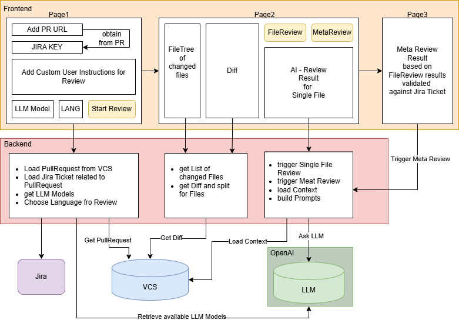

# AI Pull Request Reviewer (Standalone)

This repository provides a local, standalone web application that loads pull requests, offers a GUI with a file tree and diff viewer, and allows triggering an AI-based review (LLM) per file. Additionally, after file reviews, you can create meta-reviews across all files and check them against JIRA tickets.

In short: a tool for AI assisted code review.

## Main Features

- Load PRs (GitHub / Bitbucket support).
- Load Jira tickets (optional, can be extracted from PR metadata).
- Display file tree and select changed files.
- Per-file diff viewer.
- Trigger an AI review for each file (calls an LLM with contextual prompt, budget & diagnostics).
- Meta-review: aggregate all file reviews, optionally attach the full diff, and verify against a JIRA request.
- Session management for review sessions.

## Architecture & Key Components

The app is built with Next.js + React + TypeScript.

Important folders/files:

- `src/app/` – Next.js app routes and API endpoints
  - `api/` – Backend API routes (e.g. `reviews`, `diff`, `sessions`, `llm-models`, `meta-review`, `resolve-jira`)
  - `review/[sessionId]/page.tsx` – Review UI for a session
- `src/components/`
  - `FileTree.tsx` – Renders the file tree structure
  - `DiffViewer.tsx` – Code diff viewer
  - `ReviewPanel.tsx` – Panel to run file reviews and show results
  - `ReviewDiagnosticsPanel.tsx` – Shows warnings / diagnostics
- `src/lib/`
  - `vcs/` – VCS client abstractions and providers (GitHub, Bitbucket)
  - `llm/` – LLM client
  - `review/` 
    - runners for file/meta reviews
    - Logic for preparing review context, policies, aggregation
    - prompt builder
    - token/budgeting
  - `jira/` – JIRA helper functions
  - `session/` – Session persistence and store

## How it works (Flow)

1. Select a PR.
2. Optionally extract a JIRA ticket from the PR (e.g. via ticket key in branch name or PR title).
3. The VCS client loads the diff, changed files and metadata from the PR.
4. The UI displays the file tree and diffs.
5. The user triggers an AI review for a single file
   a) backend builds the context:
   - appends complete file content, 
   - surrounding files and tests
   - diff for file
   b) backend build fixedx system prompt and dynamic user prompt (with instructions, policies, and review criteria)
   - the prompt building is token-aware and can trim or prioritize content based on the model's token limits and configured policies
6. Call the LLM with the built prompt and context, along with a budget (max tokens) and any relevant metadata
7. The LLM response with a human-readable review, structured review items (e.g. issues found, suggestions)
8. Create a review response that contains review items, warnings/diagnostics, and meta data (tokens, model, duration). 
9. The UI presents the file review result.
10. After several file reviews, a meta-review can be started that aggregates all file reviews and checks them against the JIRA ticket.

## Technologies

- Next.js (App Router)
- React + TypeScript
- Node.js
- LLM client (custom implementation in `src/lib/llm`) — supports plugging in providers (OpenAI, Anthropic, local LLMs)
- VCS provider implementations (GitHub / Bitbucket)
- JIRA integration (via REST API)

## Local Setup (Development)

1. Install Node.js (>=16).
2. Install dependencies:

   npm install

3. Start local dev server:

   npm run dev

4. To use LLMs: configure API keys in `.env` (e.g. `OPENAI_API_KEY=...`).
